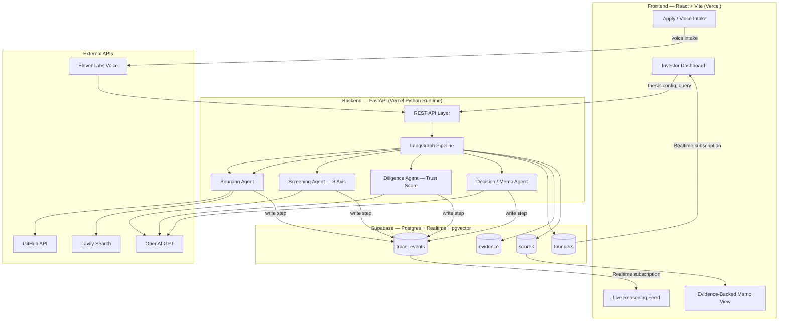

# BUILD BRIEF — [PROJECT NAME: TBD — ask the team before finalizing branding, package names, or the banner]

**Team:** VizMinds — Hack-Nation 6th Global AI Hackathon, Maschmeyer Group track ("The VC Brain: Deploying $100K Checks in 24 Hours")

**Read this entire file before writing any code.** It is the single source of truth for scope, architecture, and how you should work with the team during the build. Section 0 below is not optional — follow it throughout, not just at the start.

---

## 0. How to work with this team

- **No fake, mock, dummy, or synthetic data anywhere in the running app.** Every founder record, GitHub signal, search result, and score in the demo must come from a real, live API call. If a real integration isn't wired up yet, the feature should visibly be "not yet connected" rather than showing placeholder data.
- **Ask, don't assume, when:**
  - The project name is needed (banner, package.json name, page titles, any branding) — it is not yet decided. Ask the team directly and wait for an answer rather than inventing one.
  - A decision isn't covered in this brief (e.g. exact color palette, which sectors to hardcode into the Thesis Engine defaults, exact wording of UI copy) and there's a reasonable chance the team has a preference.
  - You need any external account, API key, or credential you don't already have. List exactly what's needed and why.
  - You're about to take an action outside the codebase (creating a Vercel project, creating a Supabase project, connecting a GitHub App, etc.) — give the team clear step-by-step manual instructions instead of assuming you can or should do it autonomously. Wait for confirmation that it's done (and any resulting keys/URLs) before continuing work that depends on it.
- **When you hit a question you can't resolve from this brief**, stop and ask it plainly, in a short list, rather than guessing and moving on. The team is relaying your questions to their own advisor and bringing back answers, so batch related questions together when possible instead of asking one at a time across many turns.
- **Deliverable includes a full README.md** documenting setup, architecture, and a "how to run the demo" section — write this as you go, not just at the end, so it never falls out of sync with the actual code.

---

## 1. The Problem & Vision

Capital flows to who you know, not what you're building. A founder's story is scattered across GitHub commits, half-built websites, hackathon wins, and social posts nobody reads closely. By the time a fund sees a founder clearly, dozens of equally strong ones have already given up waiting.

Build a data- and AI-first operating system for a single investor that discovers exceptional founders — before they even start fundraising — and deploys a decision-ready recommendation within 24 hours. Every score must trace back to real evidence. Every gap must be flagged, never guessed or fabricated.

## 2. What You're Building — Feature Summary

A working, end-to-end MVP, built across two separately deployed folders/projects (`backend/` and `frontend/`), covering all of:

- **Sourcing** — an outbound agent that scans GitHub and the open web (via Tavily) for builders before they apply, plus an inbound apply flow for founders who apply directly. Both converge into one funnel.
- **Assessment & Intelligence** — a configurable Thesis Engine, a 3-axis screening model (Founder / Market / Idea-vs-Market — scored independently, never averaged), and a per-claim Trust Score.
- **Memory** — a persistent Founder Score that never resets and follows a person across ventures, plus full evidence provenance for every conclusion.
- **Voice-first intake** (ElevenLabs) — founders with no deck can talk instead; a conversational agent runs a structured interview and produces the same schema as document intake, directly addressing the cold-start case.
- **Live Reasoning Feed** — the investor watches the agent pipeline think in real time: every search query, every extracted fact, every score, streamed live to the dashboard as it happens. This is both the "show the backend working" requirement and the Agentic Traceability stretch goal — build it as one feature, not two.

---

## 3. Architecture



**Key design choice — read this before implementing "live" anything:** true WebSockets are unreliable on Vercel serverless functions. Do not build a custom WebSocket server. Instead, every agent step is a row written to Supabase's `trace_events` table; the frontend subscribes to that table via **Supabase Realtime**. This is what powers the Live Reasoning Feed and the live Founder Score updates, without needing a persistent backend connection at all.

**Vercel timeout constraint:** a full sourcing → decision run makes several sequential LLM/API calls. Keep individual pipeline runs scoped (e.g. 5–10 outbound candidates per run) so they comfortably finish inside the serverless function's max duration. Set `maxDuration` in `backend/vercel.json` to the highest the plan allows.

---

## 4. The Three Pillars — Detailed Spec

### 4.1 Sourcing (Inbound + Outbound)
- **Inbound**: minimal apply form (deck upload or plain text + company name) → parsed by GPT into the shared founder schema (see §7).
- **Outbound**: an on-demand agent that queries the GitHub API (recently active repos/builders in target sectors) and Tavily (hackathon results, arXiv papers, product launches, accelerator cohort mentions) → normalizes hits into candidate records, scored identically to inbound applicants.
- Both funnels converge into the same Screening step — do not build two separate scoring paths.

### 4.2 Assessment & Intelligence
- **Thesis Engine**: investor sets sectors, stage, geography, check size, ownership target, risk appetite. Store as an editable JSON config in the UI; every recommendation is filtered/scored through this lens.
- **3-Axis Screening**, each with its own trend direction (improving / stable / declining), never averaged into one number:
  - Founder axis
  - Market axis (bullish / neutral / bear)
  - Idea-vs-Market axis
- **Multi-attribute reasoning**: natural-language queries like *"technical founder, Berlin, AI infra, no prior VC backing, top-tier accelerator"* resolved in one pass via structured GPT extraction against the founder schema — not five manual filters.

### 4.3 Memory
- **Founder Score**: persists in Supabase, keyed by a stable identity (GitHub handle or email), never resets, updates with every new signal about that person across ventures.
- **Evidence & Trust Score**: every claim (traction, team, market size) stored with its source snippet and a confidence level; contradictions are flagged, not hidden.
- **Explicit gaps**: any missing field (e.g. "cap table: not disclosed") shown as a labeled gap in the memo — never fabricated or silently omitted.

### 4.4 Investment Memo Output
Required sections only (per challenge brief appendix): Company snapshot, Investment hypotheses, SWOT, Problem & product, Traction & KPIs. Every claim in the memo must be clickable back to its evidence citation.

---

## 5. Tech Stack

| Layer | Choice | Why |
|---|---|---|
| Frontend | React + Vite + TailwindCSS + shadcn/ui | Fast to build, deploys cleanly to Vercel as a static SPA |
| Backend | FastAPI (Python) | Async-friendly, matches team's existing FastAPI/OpenAI experience |
| Agent Orchestration | LangGraph | Explicit, inspectable state graph — each node = one traceable pipeline stage, which is what makes the Live Reasoning Feed possible |
| LLM Reasoning | OpenAI (GPT-4o / GPT-4.1) | Structured extraction, scoring, memo generation, embeddings |
| Outbound Sourcing | Tavily Search API | Built for AI agent retrieval; hackathons/papers/launches discovery + market context |
| Founder Signal | GitHub REST/GraphQL API | Free at hackathon volume; repo activity, commit cadence, README quality |
| Voice Intake & Briefing | ElevenLabs Conversational AI + TTS | Voice interview for pre-track-record founders; audio memo briefing for investors |
| Data + Realtime + Vector | Supabase (Postgres + Realtime + pgvector) | One free-tier service covers persistence, the live trace feed, and evidence embeddings |
| Hosting | Vercel — two separate projects | Per requirement, see §9 |

### Credits available — what's runtime vs. tooling
- **OpenAI, Tavily, ElevenLabs, GitHub API** — these are runtime dependencies of the app itself, wired in as described above.
- **Emdash, Woz** — developer productivity tooling for running/optimizing the coding agent itself (parallel agent workspaces, Claude Code performance). Not part of the deployed app's stack. Use them to speed up your own build process if useful; do not add them as app dependencies.
- **Lovable** — an alternative rapid UI builder. Not needed here since the frontend is being hand-built with React + Vite for tight integration with the FastAPI backend and Supabase Realtime — don't switch to Lovable for the primary frontend unless the team explicitly asks for it.

---

## 6. Repository Structure

```
project-root/
├── backend/
│   ├── app/
│   │   ├── main.py                # FastAPI entrypoint
│   │   ├── api/
│   │   │   ├── source.py          # /api/source — trigger sourcing run
│   │   │   ├── screen.py          # /api/screen
│   │   │   ├── diligence.py       # /api/diligence
│   │   │   ├── decision.py        # /api/decision — final memo
│   │   │   ├── founders.py        # CRUD + Founder Score lookup
│   │   │   └── voice.py           # ElevenLabs intake + briefing endpoints
│   │   ├── agents/
│   │   │   ├── graph.py           # LangGraph pipeline definition
│   │   │   ├── sourcing_agent.py
│   │   │   ├── screening_agent.py
│   │   │   ├── diligence_agent.py
│   │   │   └── memo_agent.py
│   │   ├── integrations/
│   │   │   ├── github_client.py
│   │   │   ├── tavily_client.py
│   │   │   ├── openai_client.py
│   │   │   ├── elevenlabs_client.py
│   │   │   └── supabase_client.py
│   │   ├── schemas/                # Pydantic models — shared founder schema
│   │   └── trace.py                # writes structured events to trace_events
│   ├── requirements.txt
│   └── vercel.json
│
├── frontend/
│   ├── src/
│   │   ├── pages/
│   │   │   ├── Dashboard.tsx       # ranked list + thesis config
│   │   │   ├── FounderProfile.tsx  # evidence, scores, memo
│   │   │   └── Apply.tsx           # inbound intake (doc or voice)
│   │   ├── components/
│   │   │   ├── LiveReasoningFeed.tsx   # Supabase Realtime subscriber
│   │   │   ├── ThreeAxisScoreCard.tsx
│   │   │   ├── EvidenceCitation.tsx
│   │   │   └── ThesisEngineForm.tsx
│   │   ├── lib/supabaseClient.ts
│   │   └── App.tsx
│   ├── package.json
│   └── vercel.json
│
├── assets/                         # banner/screenshots for README, once available
├── docs/
│   └── data-model.sql              # Supabase schema (see §7)
└── README.md                       # generate and keep updated as you build
```

---

## 7. Data Model

```sql
-- docs/data-model.sql
create table founders (
  id uuid primary key default gen_random_uuid(),
  identity_key text unique not null,       -- github handle or email, used for Memory persistence
  name text, source text,                  -- 'inbound' | 'outbound_github' | 'outbound_tavily' | 'voice_intake'
  founder_score numeric,
  founder_score_trend text,                -- 'improving' | 'stable' | 'declining'
  created_at timestamptz default now(),
  updated_at timestamptz default now()
);

create table evidence (
  id uuid primary key default gen_random_uuid(),
  founder_id uuid references founders(id),
  claim text not null,
  source_url text,
  source_snippet text,
  trust_score numeric,                     -- 0-1, per-claim
  evidence_type text,                      -- 'known_signal' | 'statistical_association' | 'no_signal'
  created_at timestamptz default now()
);

create table scores (
  id uuid primary key default gen_random_uuid(),
  founder_id uuid references founders(id),
  axis text not null,                      -- 'founder' | 'market' | 'idea_vs_market'
  score numeric,
  trend text,
  rationale text,
  created_at timestamptz default now()
);

create table trace_events (
  id bigint generated always as identity primary key,
  run_id uuid not null,
  agent text not null,
  step text not null,
  message text not null,
  evidence_ref text,
  confidence numeric,
  ts timestamptz default now()
);
-- enable Realtime on trace_events + founders via the Supabase dashboard (Database → Replication)
```

---

## 8. Environment Variables

**Backend (`backend/.env`)**
```
OPENAI_API_KEY=
TAVILY_API_KEY=
GITHUB_TOKEN=              # optional but raises rate limit from 60/hr to 5000/hr
ELEVENLABS_API_KEY=
SUPABASE_URL=
SUPABASE_SERVICE_ROLE_KEY=
FRONTEND_ORIGIN=https://your-frontend.vercel.app
```

**Frontend (`frontend/.env`)**
```
VITE_API_BASE_URL=https://your-backend.vercel.app
VITE_SUPABASE_URL=
VITE_SUPABASE_ANON_KEY=
```

None of these keys exist yet in this environment — when you reach the point of needing one, stop and tell the team exactly which key you need and why, rather than proceeding with a stub.

---

## 9. Deployment — Vercel (frontend + backend, separate)

Deploy **two separate Vercel projects**, both pointing at the same repo with different root directories:

1. **Backend** — root directory `backend/`, framework preset "Other." Vercel picks up the Python runtime from `vercel.json`. Set `maxDuration` as high as the plan allows (Hobby: 60s).
2. **Frontend** — root directory `frontend/`, framework preset "Vite." Set `VITE_API_BASE_URL` to the deployed backend URL.

Whenever a deployment step requires the team to click through the Vercel or Supabase dashboard themselves (creating the project, entering env vars, connecting the repo, enabling Realtime), write out the exact steps as a numbered list and ask them to confirm once done, rather than assuming it's already set up.

---

## 10. Judging Criteria Mapping (Maschmeyer Group track)

| Criterion | Weight | Where it's demonstrated |
|---|---|---|
| Data Architecture and Intelligence | 30% | Sourcing pillar (GitHub + Tavily), shared founder schema, cold-start voice intake path |
| Intelligent Analysis and Trust | 25% | 3-axis scoring, per-claim Trust Score, evidence citations in every memo line |
| Investment Utility & Execution | 30% | End-to-end run: sourcing → screening → diligence → decision memo, live in the demo |
| User Experience and Design | 15% | Investor dashboard + Live Reasoning Feed — makes AI reasoning legible to a non-technical user |

**Stretch goal — Agentic Traceability** (prioritized if time allows): fully covered by the Live Reasoning Feed + `evidence_ref` field on every trace event and score. Clicking any conclusion in the UI should jump to the exact source snippet that produced it.

---

## 11. Team

**Team VizMinds** — Hack-Nation 6th Global AI Hackathon

| Member | Role |
|---|---|
| Muneeb Ahmed Khan | Team Lead & Systems/Agent Architecture |
| Abdullah | Frontend Engineer & Product Design |
| Ayna Khan | Backend Engineer — Data & Integrations Lead |

---

## 12. Deliverable Checklist

- [ ] Working `backend/` deployed on Vercel, all endpoints live, no mock responses
- [ ] Working `frontend/` deployed on Vercel, connected to the live backend
- [ ] Inbound apply flow (document) + voice intake flow (ElevenLabs), both producing the same founder schema
- [ ] Outbound sourcing live against real GitHub + Tavily data
- [ ] 3-axis scoring with visible trend + rationale per founder
- [ ] Live Reasoning Feed streaming real agent steps via Supabase Realtime
- [ ] Evidence-backed memo with clickable citations and explicit gap-flagging
- [ ] Founder Score persisting across multiple runs for the same identity
- [ ] README.md documenting architecture, setup, and demo walkthrough
- [ ] Project name and branding finalized (ask the team — see §0)
