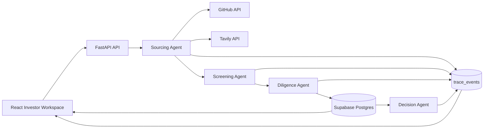

# LodeSTAR


**Discover exceptional founders before they start fundraising.**


LodeSTAR is an AI-first investor workspace built by Team VizMinds for the Maschmeyer Group "VC Brain" challenge at Hack-Nation's 6th Global AI Hackathon.

It helps a solo investor discover technical founders before they begin fundraising, test each opportunity against a configurable investment thesis, and produce an evidence-backed decision memo within 24 hours.

## Product

- **Thesis Engine** configures sector, stage, geography, check size, ownership target, and risk appetite.
- **Outbound Sourcing** combines live GitHub and Tavily discovery.
- **Inbound Intake** sends written applications and voice transcripts through the same pipeline.
- **Three-Axis Screening** scores Founder, Market, and Idea vs. Market independently.
- **Evidence Ledger** stores claim provenance, source snippets, trust scores, and explicit gaps.
- **Live Reasoning Feed** streams agent trace events through Supabase Realtime.
- **Founder Memory** persists profiles and score trends across runs.
- **Investment Memo** generates five required decision sections with evidence references.

The running application does not use fake founders, evidence, scores, or memos. Missing integrations return an explicit setup or provider error.

## Architecture



```text
frontend/                 React, Vite, TypeScript, Tailwind CSS
  src/pages/              Dashboard, founder profile, founder intake
  src/components/         Thesis, pipeline, evidence, and live trace UI
  src/lib/                API, Supabase, thesis, and display helpers

backend/                  FastAPI and agent pipeline
  app/api/                REST endpoints
  app/agents/             Sourcing, screening, diligence, memo pipeline
  app/integrations/       GitHub, Tavily, OpenAI, Supabase, ElevenLabs
  app/schemas/            Request and domain models

docs/data-model.sql       Supabase schema and indexes
DESIGN.md                 Nike-inspired product design reference
BUILD_BRIEF.md            Hackathon challenge and implementation brief
```

## Local Setup

### 1. Supabase

1. Create a Supabase project.
2. Run `docs/data-model.sql` in the SQL editor.
3. Enable RLS and frontend read policies for the exposed tables.
4. Enable Realtime replication for `public.trace_events` and `public.founders`.
5. Copy the project URL, anon key, and service role key.

Never expose the service role key in the frontend.

### 2. Backend

```powershell
cd backend
python -m venv .venv
.\.venv\Scripts\Activate.ps1
pip install -r requirements.txt
Copy-Item .env.example .env
```

Fill the values in `backend/.env`, then start the API:

```powershell
python -m uvicorn app.main:app --host 127.0.0.1 --port 8000
```

Required backend values:

```env
OPENAI_API_KEY=
TAVILY_API_KEY=
SUPABASE_URL=
SUPABASE_SERVICE_ROLE_KEY=
```

`GITHUB_TOKEN` is recommended for higher API limits. `ELEVENLABS_API_KEY` is required only for live ElevenLabs connectivity; transcript intake works through `/api/voice/transcript`.

### 3. Frontend

```powershell
cd frontend
npm install
Copy-Item .env.example .env
npm run dev -- --host 127.0.0.1
```

Fill `frontend/.env` with:

```env
VITE_API_BASE_URL=http://127.0.0.1:8000
VITE_SUPABASE_URL=https://YOUR_PROJECT_REF.supabase.co
VITE_SUPABASE_ANON_KEY=YOUR_ANON_OR_PUBLISHABLE_KEY
```

Open `http://127.0.0.1:5173`.

## Demo Flow

1. Set the investment thesis on the dashboard.
2. Run outbound sourcing and watch the live reasoning feed.
3. Open a ranked founder to inspect scores, evidence trust, and gaps.
4. Generate the investment memo and follow its evidence references.
5. Show the written or voice-transcript inbound path under Founder Intake.

## API

| Method | Endpoint | Purpose |
| --- | --- | --- |
| `GET` | `/health` | Configuration readiness |
| `GET` | `/api/founders` | Founder memory |
| `GET` | `/api/founders/{id}` | Profile, evidence, and scores |
| `POST` | `/api/source/outbound` | GitHub and Tavily sourcing pipeline |
| `POST` | `/api/source/inbound` | Written application pipeline |
| `POST` | `/api/voice/transcript` | Voice transcript pipeline |
| `POST` | `/api/screen` | Re-run three-axis screening |
| `POST` | `/api/diligence` | Re-run evidence review |
| `POST` | `/api/decision` | Generate investment memo |

Interactive API documentation is available locally at `http://127.0.0.1:8000/docs`.

## Verification

```powershell
cd frontend
npm run build

cd ..\backend
python -m compileall -q app
python scripts/check_integrations.py
```

The integration check performs live API calls and may consume a small amount of provider quota. GitHub Actions runs the frontend build and backend compilation on every push and pull request.

## Team VizMinds

| Member | Role |
| --- | --- |
| Muneeb Ahmed Khan | Team Lead and Systems/Agent Architecture |
| Abdullah | Frontend Engineer and Product Design |
| Ayna Khan | Backend Engineer, Data and Integrations Lead |
